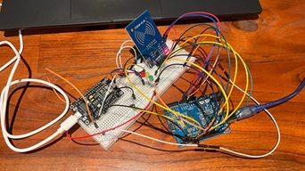
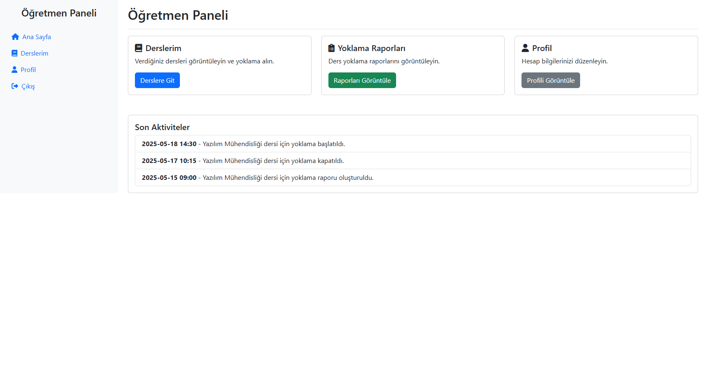
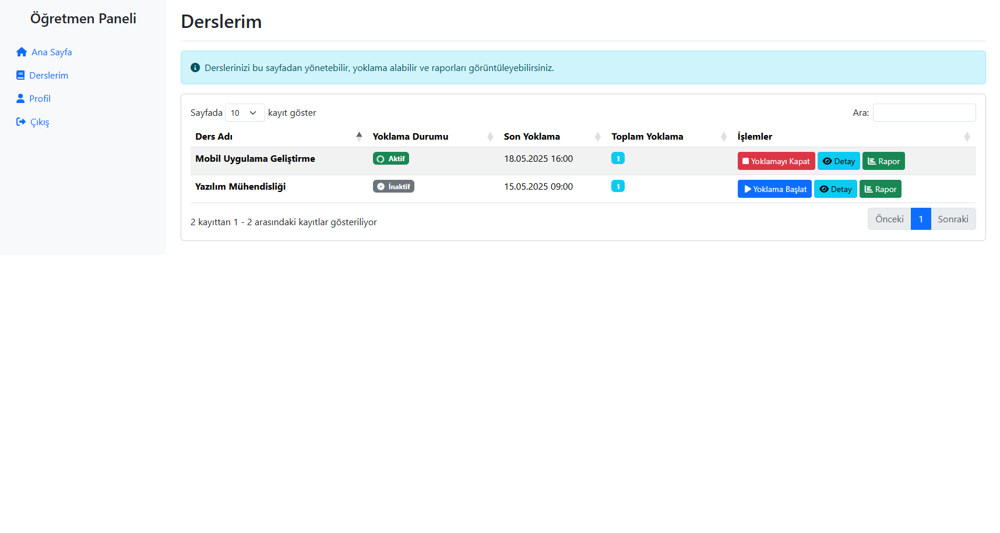
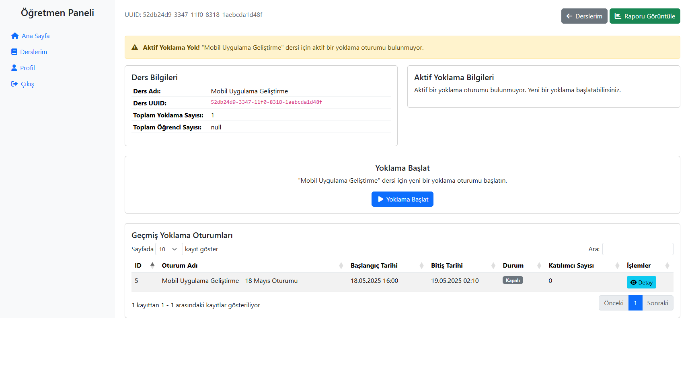
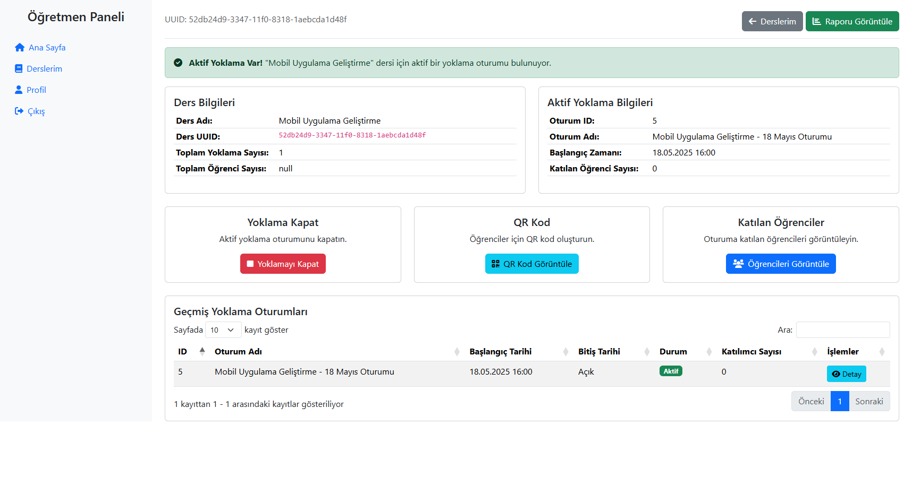

# 📚 RFID-Based Attendance System

This project is an attendance system composed of hardware and software components that allows teachers and students to perform attendance using RFID cards.

<a href="./misc/images/master.jpg">

</a>

<table>
  <tr>
      
      
  </tr>
  <tr>
      
      

  </tr>
</table>

## 🧩 Project Components

### Hardware

* **Arduino Uno** — Main control unit of the device
* **NodeMCU V3 (ESP8266)** — Provides internet connection over Wi-Fi
* **RC522 RFID Reader** — For card scanning
* **LEDs (Red, Yellow, Green)** — For visual notifications
* **Buzzer** — For audible alerts

### Software & Services

* **Python Flask** — Backend service (REST API)
* **MySQL** — Database (teacher, student, device, attendance data)
* **Redis** - Object storage
* **Traefik** — Reverse proxy and load balancer
* **Cloudflare** — DNS routing and security
* **Frontend (HTML/CSS/JS)** — Web panel for teachers

## 📌 Scenarios and Device Behavior

### ⏱️ Starting Attendance (Teacher Card)

* If attendance is **not open**:
  * When the card is scanned, returns `status: 100`.
  * LEDs light up in the order: **Green → Yellow → Red** with 50ms intervals, buzzer is active during each LED.
  * Attendance session is started.

* If attendance **is open**:
  * Returns `status: 000`
  * LEDs light up: **Red → Yellow → Green** with 150ms intervals, buzzer is active.

### 🧑‍🎓 Student Card

* If attendance is **not open**:
  * Returns `status: 400`
  * **Red LED** + buzzer
  
* If attendance **is open**:

  * Returns `status: 200`
  * **Green LED** and **buzzer** activate for 50ms.
* Unreadable card:

  * **Yellow LED** blinks for 150ms with buzzer.
* Unrecognized card:

  * Returns `status: 400`
  * **Red LED** + buzzer

### 🔚 Ending Attendance (Teacher Card Again)

* Returns `status: 000`
* LEDs light up: **Red → Yellow → Green** for 150ms each, with buzzer
* Attendance session ends

## 🔁 Data Flow & Infrastructure

```
RFID Device (ESP8266)
││
│├──> DNS Request
││
│└──> Cloudflare (DNS & SSL)
↓
Traefik Reverse Proxy
↓
Flask Backend API
↓
MySQL
```

* Each device is identified by a UUID.
* POST requests are sent to the backend with `UUID` and `Card ID`.
* Traefik routes the incoming request to the appropriate Flask service.

## 🌍 Frontend (Teacher Panel)

* Login and authentication
* Lesson and device selection
* Start/stop attendance buttons
* Real-time view of scanned students
* Listing past attendance records

## 🔒 Security Features

* **HTTPS and DDoS protection via Cloudflare**
* **UUID-based device authentication**
* **Role-based access (teacher/student)**
* **Encrypted database connections**

## 🚀 Installation

> The system also supports Docker-based containerized installation. Below are basic setup steps.

### Backend

```bash
cd backend
pip install -r requirements.txt
python app.py
```

### Frontend

Static files are routed under `/frontend` via Traefik.

### MySQL

You only need to create the database in MySQL. The Flask application will automatically create the required tables when it starts.

```sql
CREATE DATABASE burada;
```

> **Note:** If you encounter a table creation error when starting the application, delete all tables in the database and restart the Flask application.

## 📈 Development Potential

* NFC support
* Offline registration and synchronization
* Mobile application integration
* Advanced reporting and analytics
* Faster messaging with MQTT

## 👨‍💻 Contribute

We welcome contributions! For feature suggestions, bug reports, and pull requests, please use the [Issues](https://github.com/tahakara/burada/issues) or [Pull Requests](https://github.com/tahakara/burada/pulls) sections.

## 📄 License

Licensed under the MIT License.

---

# 🔧 **Setup**

## IoT Device Installation

This document includes installation and wiring details of the attendance device working with Arduino + NodeMCU + RC522 RFID hardware.

### 📦 Hardware Requirements

* Arduino Uno
* NodeMCU V3 (ESP8266)
* RC522 RFID Reader
* 3x LEDs (Red, Yellow, Green)
* 1x Buzzer
* Jumper wires
* 2x 1kΩ resistors (for voltage divider)

### 🔌 Hardware Connections

#### Arduino Uno – NodeMCU V3 Connection

| Arduino | NodeMCU V3 | Description              |
| ------- | ---------- | ------------------------ |
| D2      | D6         | Direct connection        |
| D3      | D7         | **With voltage divider** |
| GND     | G (GND)    | Shared ground            |
| 5V      | VIN        | NodeMCU power supply     |
| RST     | RST        | Reset synchronization    |

> ⚠️ You must use a **1kΩ–1kΩ** voltage divider on D3–D7. NodeMCU pins operate at 3.3V.

---

#### Arduino Uno – RC522 RFID Connection

| Arduino | RC522 | Description     |
| ------- | ----- | --------------- |
| 3.3V    | 3.3V  | Power (3.3V)    |
| GND     | GND   | Ground          |
| D9      | RST   | Reset pin       |
| D10     | SDA   | SPI Chip Select |
| D11     | MOSI  | SPI data output |
| D12     | MISO  | SPI data input  |
| D13     | SCK   | SPI clock pin   |

> ⚠️ Ensure the RC522 module is powered at **3.3V**. 5V may damage the module.

---

#### Arduino Uno – Indicators

| Arduino | Part       | Description         |
| ------- | ---------- | ------------------- |
| D5      | Buzzer     | Audible warning     |
| D6      | Red LED    | Error/Reject status |
| D7      | Yellow LED | Reading status      |
| D8      | Green LED  | Success status      |

> It is recommended to connect LEDs with series resistors (220Ω–330Ω).

### ⚙️ Software Setup

#### Arduino IDE

1. Install Arduino IDE: [https://www.arduino.cc/en/software](https://www.arduino.cc/en/software)
2. Install required libraries:

   * `SPI`
   * `MFRC522`
   * `SoftwareSerial` (if needed)

#### Uploading Arduino Code

1. Open the `burada_ardunio.ino` file.
2. Update the following values:
3. Upload the sketch to the Arduino.

---

#### Uploading NodeMCU v3 Code

1. Open the `burada_node.ino` file.
2. Update the following values:
3. Make sure you are connected to the ESP8266’s IP via NodeMCU.
4. Upload the sketch.

```cpp
#define WIFI_SSID "ssid"        // WiFi SSID
#define WIFI_PASSWORD "pss"     // WiFi password
#define HOST "sub.example.com"  // Server address
#define PORT 443                // Default port for HTTPS
#define IP_PATH "/ip"
#define DATA_PATH "/burada"

#define cookieDust "88888888-4444-4444-4444-121212121212"
#define cookieDevice "88888888-4444-4444-4444-121212121212"
```

---

#### 🌐 NodeMCU (ESP8266) Firmware

NodeMCU sends data from Arduino to the backend via Wi-Fi.

#### Requirements

* `ESP8266 Board Manager` installed in Arduino IDE
* `SoftwareSerial` (for Arduino → ESP communication)

#### Code Summary

* ESP8266 receives data from Arduino via D6 and D7 pins.
* Sends data to backend via JSON POST requests.

---

### 🔄 Data Flow

1. Card is scanned.
2. Arduino → Sends JSON data to ESP8266
3. ESP8266 → Sends POST request to Flask backend over Wi-Fi
4. Backend → Returns JSON response (`status: 100`, `200`, `400`, `000`)
5. ESP8266 → Returns response to Arduino via serial
6. Arduino manages LEDs and buzzer based on response

---

### 🧪 Testing and Verification

* Each part should be tested individually (LEDs, buzzer, card reading).
* Monitor POST responses via serial monitor when scanning a card.
* Test LED and buzzer scenarios to verify accuracy.

---

### ⚠️ Notes

* NodeMCU and Arduino must share a **common ground**.
* Voltage divider is **mandatory** on D3–D7 line due to 3.3V operation of ESP8266.
* RC522 **must not** be powered with 5V.

---

## 💻 Server Installation

Ensure at least 2-core CPU and 2 GB RAM for the server configuration.

### 📦 Requirements

* 💻 2 Core, 2GB RAM VM (Ubuntu, any version)
* 🐋 Docker [*Installation Guide*](https://docs.docker.com/engine/install/ubuntu/)

---

### 🐋 Docker Installation

Run the following command to uninstall all conflicting packages:

```bash
for pkg in docker.io docker-doc docker-compose docker-compose-v2 podman-docker containerd runc; do sudo apt-get remove $pkg; done
```

#### **Install using the apt repository**

##### *1. Set up Docker's apt repository.*

```bash
sudo apt-get update
sudo apt-get install ca-certificates curl
sudo install -m 0755 -d /etc/apt/keyrings
sudo curl -fsSL https://download.docker.com/linux/ubuntu/gpg -o /etc/apt/keyrings/docker.asc
sudo chmod a+r /etc/apt/keyrings/docker.asc

echo \
  "deb [arch=$(dpkg --print-architecture) signed-by=/etc/apt/keyrings/docker.asc] https://download.docker.com/linux/ubuntu \
  $(. /etc/os-release && echo "${UBUNTU_CODENAME:-$VERSION_CODENAME}") stable" | \
  sudo tee /etc/apt/sources.list.d/docker.list > /dev/null
sudo apt-get update
```

##### *2. Install the Docker packages.*

```bash
sudo apt-get install docker-ce docker-ce-cli containerd.io docker-buildx-plugin docker-compose-plugin
```

##### *3. Verify installation by running the hello-world image:*

```bash
sudo docker run hello-world
```

### Running All Services

* **Before starting services, you must replace**:

  * All SSL certs
  * Environment variables in `docker-compose.yaml`

```bash
# Navigate to directory with docker-compose.yaml
# Run the docker-compose.yaml
$ docker compose -f docker-compose.yaml up -d
```

---

### 📂 File Structure

```
/burada
├── burada_ardunio/
│   └── burada_ardunio.ino
├── burada_node/
│   └── burada_node.ino
├── server/
│   └── src/
│   └── docker-compose.yaml
└── README.md
```

---

### 👨‍🔧 Support

For issue reporting or support, please use the [Issues](https://github.com/tahakara/burada/issues) section.

---

*Created with ❤️ by [GitHub Copilot](https://github.com/features/copilot)*

---
